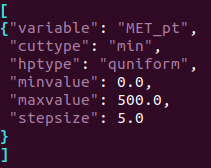
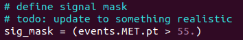
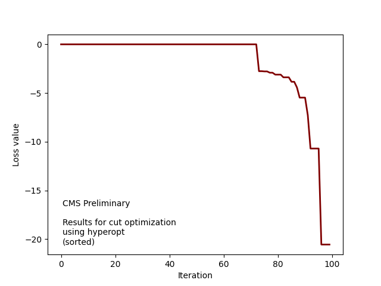
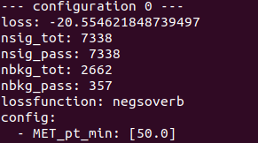

# Mini example of running hyperopt for cut optimization on NanoAOD files

### Making the search grid
The first step is to define a search grid, i.e. a list of potential variables to cut on with a range of numerical cut values to explore.
The search space can be defined directly in a python file, see [the hyperopt documentation](https://github.com/hyperopt/hyperopt/wiki/FMin#2-defining-a-search-space) for more details on the syntax.
Alternatively, for relatively simple cases, one can make a simplified json file and convert it to the correct hyperopt syntax using `make_grid.py`.

For example, go into the `grids` subfolder, and see `grid_example.json` for an example on the correct formatting:

This simple grid spans only one variable (the MET) in steps of 5 GeV from 0 to 500 GeV.
Then run `python3 make_grid -i grid_example.json -o grid_example.pkl` to make the grid and store in in a pkl file, which will be used in the next step.

### Running hyperopt
For general information, see [the hyperopt documentation](https://github.com/hyperopt/hyperopt/wiki/FMin).
For running the example script, use `python3 run_hyperopt.py -i /pnfs/iihe/cms/ph/sc4/store/mc/RunIISummer20UL18NanoAODv9/TTZToLLNuNu_M-10_TuneCP5_13TeV-amcatnlo-pythia8/NANOAODSIM/106X_upgrade2018_realistic_v16_L1v1-v1/40000/4C6BFB3E-92A5-8F45-ACFE-BAED3415B392.root -g grids/grid_example.pkl --nentries 10000 -n 100 -o output_test.pkl`.
This command reads the first 10000 entries of the specified NanoAOD file, runs hyperopt for 100 iterations using the specified search grid, and stores the results in `output_test.pkl`.

Note: in this simple example, the distinction between signal and background is made on the basis of MET (i.e. the same variable as used in the search grid), as shown below:

This is just a placeholder for checking the method and should be replaced by a valid signal vs. background distinction for realistic use.

### Checking the output
One can plot the loss of each iteration using `python3 plot_loss.py -i output_test.pkl -o output_test.png -s`, which gives the following result:

For many iterations, the loss is 0 as no 'background' events pass the selection for any MET cut above 55 GeV, in which case the loss is set to 0.
Note: the loss function is defined here as -S/B, which is not properly defined if B=0, but that definition can be changed to something more appropriate as needed.
In this simple example, we know that the lowest loss should be achieved for a MET cut of 50 GeV, i.e. the grid point as close to 55 GeV as possible without exceeding it.
This can be checked using `python3 get_best.py -i output_test.pkl -n 10`, which prints out the 10 best configurations, the top one of which reads as follows:

